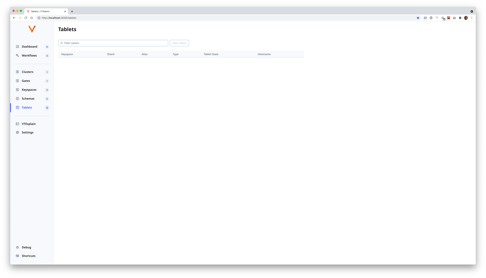

# VTAdmin Developer's Guide

This guide is written for anyone that wants to debug, develop on, or otherwise understand VTAdmin. (Most of this applies to developing in other parts of Vitess, too.)

By the end of this guide, you will know how to:

- Run Vitess + VTAdmin locally + in debug mode


# Prerequisites

This guide assumes:

- No prior knowledge of Vitess
- No prior knowledge of Go

For the sake of simplicity, we also assume:

- You're running macOS
- You use VSCode
- You've checked out the [vitessio/vitess repo](https://github.com/vitessio/vitess) at a location that we'll henceforth call `$VTROOT` (e.g., `~/vitess`).


# 1. Running VTAdmin (and Vitess) locally

⚠️ **If you get stuck:**
- https://vitess.io/docs/get-started/local
- https://vitess.io/docs/contributing/build-on-macos

## 1.1 Run Vitess

Follow https://vitess.io/docs/get-started/local/#start-a-single-keyspace-cluster

## 1.2 Run VTAdmin

```bash
cd $VTROOT/examples/local
source ./env.sh
./scripts/vtadmin-up.sh
```

vtadmin-web starts on http://localhost:3000 and looks like this:



vtadmin-api starts on http://localhost:14200. We can always query it from the command line, if we want to. (This will come in handy later in the guide, when we start making changes to vtadmin-api.)

```bash
$VTROOT/examples/local $ curl -s "http://localhost:14200/api/gates" | jq .

{
  "result": {
    "gates": [
      {
        "hostname": "localhost:15991",
        "cluster": {
          "id": "local",
          "name": "local"
        }
      }
    ]
  },
  "ok": true
}
```


Things will be pretty sparse until we run Vitess in the next section. 🤠


<details>
<summary>
Q. How does VTAdmin "know" about one cluster and one gate, given that Vitess isn't running (yet)?
</summary>

The `vtadmin-up.sh` script we ran in step 1.2 starts VTAdmin using "static file discovery", where the vtgates and vtctlds in our cluster are described in a staitc .json file:

```json
{
	"vtgates": [
		{
			"host": {
				"hostname": "127.0.0.1:15991",
				"cell": "us-east-1b",
				"pool": "qa",
				"keyspaces": ["commerce", "customer"]
			}
		}
	],
	"vtctlds": [
		{
			"host": {
				"hostname": "127.0.0.1:15999"
			}
		}
	]
}
```
</details>


# 2. Build Vitess

Follow the ["Build on macOS"](https://vitess.io/docs/contributing/build-on-macos) documentation.
